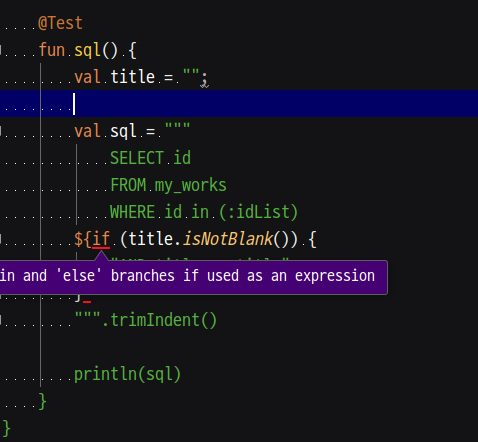
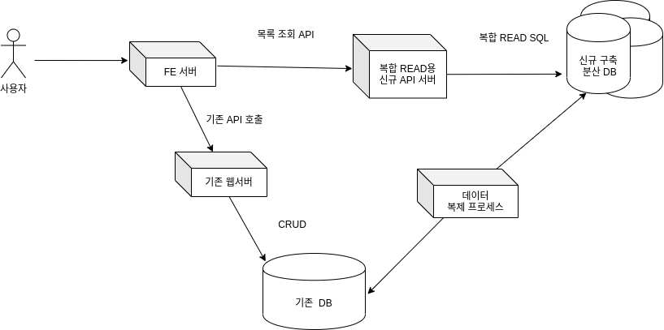

= 엔티티 클래스 설계와 퍼시스턴스 프레임워크
:toc:
:doctype: book
:deckjs_theme: swiss
:author: 정상혁
:revdate: 2020-05-07
:revnumber: 1.0
:backend: deckjs
:scrollable:

== 발표자 & 주제 소개

=== 발표자 : 정상혁

[incremental="true"]
* 경력
** (2004~2008) 삼성 SDS : 공공기관 SI 프로젝트 참여
** (2008~2020) 네이버 : 다양한 조직의 코드를 분석할 기회가 많았음
*** 현재 : Platform Labs 소속, 네이버 페이 관련 프로젝트 참여 중
* 돌아보니 대부분 DB와 연결된 기능을 개발하는 프로젝트를 수행

=== 경력동안 늘 떠나지 않은 고민

[incremental="true"]
* DB 테이블과 연관된 클래스를 어떻게 만들어야할까?
* 퍼시스턴스 프레임워크는 어떤 것을 써야 할까?

=== 발표 주제
[incremental="true"]
* 이 고민을 풀어가는 과정에서 경험, 글, 주변 동료로부터 배운 것들
* https://github.com/benelog/entity-dev/blob/master/src/index.adoc[발표 내용의 한 페이지 뷰]

= 난관의 여정

== 최고속(?) 웹개발 스타일 예제

Spring Boot + JSP

[source,java]
.Spring Boot에서 URL to JSP 매핑 선언
----
public class Application extends WebMvcConfigurerAdapter {

    public static void main(String[] args) {
        SpringApplication.run(Application.class, args);
    }

    @Override
    public void addViewControllers(ViewControllerRegistry registry) {
        registry.addViewController("/repos").setViewName("repos");
     }
}
----

[source,html]
.repos.jsp
----
<%@ page language="java" contentType="text/html; charset=UTF-8" pageEncoding="UTF-8"%>
<%@ taglib prefix="c" uri="http://java.sun.com/jsp/jstl/core" %>
<%@ page import="org.springframework.web.context.support.WebApplicationContextUtils"%>
<%@ page import="org.springframework.jdbc.core.ColumnMapRowMapper"%>
<%@ page import="org.springframework.web.context.WebApplicationContext"%>
<%@ page import="javax.sql.DataSource"%>
<%@ page import="java.util.List"%>
<%@ page import="java.util.ArrayList"%>
<%@ page import="java.util.Map"%>
<%@ page import="java.util.HashMap"%>
<%@ page import="org.springframework.jdbc.core.namedparam.NamedParameterJdbcTemplate"%>
<c:set var="sql">
	SELECT r.name, r.description, a.name AS creator_name ,  a.email
	FROM repo r
		INNER JOIN account a ON a.id = r.created_by
	WHERE a.email = :email
</c:set>

<%
    String email = request.getParameter("email");
    String sql = (String) pageContext.getAttribute("sql");

    WebApplicationContext ctx = WebApplicationContextUtils.getWebApplicationContext(getServletContext());
    DataSource ds = (DataSource) ctx.getBean("dataSource");
    NamedParameterJdbcTemplate db = new NamedParameterJdbcTemplate(ds);
    Map<String, Object> params = Map.of("email", email)

    List<Map<String,Object>> repos = db.<Map<String,Object>>query(sql, params, new ColumnMapRowMapper());
    request.setAttribute("repos", repos);
%>
<!DOCTYPE html>
<html>
<head>
<meta http-equiv="Content-Type" content="text/html; charset=UTF-8">
<title>저장소 조회</title>
</head>
<body>
    <h1>저장소를 만든 사람의 이메일로 검색하기</h1>
    <form action="/files" method="GET">
    <h2>이메일 입력</h2>
    

        <input type="text" name="email" size="40" value="${email}"> <input type="submit" value="조회">
    

    </form>

    <h2>조회 결과</h2>
    <table border="1">
        <tr>
            <th>저장소 이름</th>
            <th>저장소 설명</th>
            <th>생성자</th>
            <th>이메일</th>
        </tr>
        <c:forEach var="item" items="${repos}">
        <tr>
            <td>${item.name}</td>
            <td>${item.description}</td>
            <td>${item.creator_name}</td>
            <td>${item.email}</td>
        </tr>
        </c:forEach>
    </table>
</body>
</html>
----

== 최고속(?) 웹개발 스타일 분석

=== 어떤 분들에게는 감동의 지점

[incremental="true"]
* 파일 하나만 보면 됨
* SQL 고치고 서버 내렸다 올릴 필요 없음

=== 뭐라고 부를까?

[incremental="true"]
* Model 1?
* SMART UI 패턴
** https://www.amazon.com/Domain-Driven-Design-Tackling-Complexity-Software/dp/0321125215[Domain-Driven Design(에릭에반스, 2003)]의 1장에서 소개

=== 한계

[incremental="true"]
* 컴파일(빌드) 시점에 속성명, 타입이 검사되지 않음
* SQL, 로직의 중복
* 테스트 코드 작성의 어려움

=== 뷰 레이어의 분리

[incremental="true"]
*  `java.util.Map`가 여러 레이어를 거쳐갈 때의 한계
** Map에는 뭐가 들어 있는지, 어디에서 어떤 속성이 참조되고 있는지 확인하기 어렵다.
** 실수, 고치기 어려움 -> 더 이상 초고속이 아니다.
* 속성이 선언된 클래스가 필요하다

== 만능 클래스 (1)

[incremental="true"]
DB 컬럼, 응답,요청에 필요한 모든 속성이 하나의 클래스에 있는 경우

[incremental="true"]
[source,java]
----
public class Issue {
     private int id;
     private String title;
     private List<Account> subscribers;
     private String searchKeyword; // 검색어
     private boolean subscribed; // 내가 구독하고 있는지의 여부
}
----

[source,java]
.JPA,Jackson JSON,Swagger의 애너테이션이 하나의 클래스에
----

@Entity
@Table(indexes = {
    @Index(columnList = "createdBy"),
    @Index(columnList = "title")
})
@ApiModel(value = "Issue", description = "이슈")
public class Issue {
    @Column("id")
    private Integer id;

    @ApiModelProperty("이슈 제목")
    @Column("title")
    private String title;

    @JsonIgnore // 이슈 목록 조회때는 필요 없음.
    private List<Account> unsubscribers;
}
----

== 만능 클래스 (2)
연관된 모든 테이블의 데이터를 담은 클래스가 주는 어려움

[source,java]
----
public class Issue {
     private Repo repo;
     private List<Comment> comments;
     private List<Label> labels;
     private Milestone milestone;
     private List<Account> partipants;
}
----

[incremental="true"]
* Account(사용자 계정) 객체가 account.id를 참조하는 모든 테이블과 대응되는 객체를 의존하는 경우

[source,java]
----
public class Account {
     private List<Issue> myIssues;
     private List<Repo> myRepos;
     private List<Comment> myComment;
     private List<Label> myLabels;
}
----

[incremental="true"]
* User(Account) 클래스를 보면 ORM 사용 성숙도를 알 수 있다.

=== 부작용
[incremental="true"]
* 성능 저하
** 항상 연관된 객체를 다 조회한다면 불필요한 쿼리가 많이 날아감
** N+1 쿼리 주의해야 함
* Lazy loading을 쓰지 않고 수동으로 값을 채울 때의 난관
*** `Issue.getComments()` 에 값이 채워질지 아닐지는 DAO 내부까지 따라가봐아 알수 있다.
*** 비슷한 메서드가 여러개 생길수도 있다.
**** `findIssueById()`, `findIssueByIdWithComments()`

== 만능 클래스가 뷰까지 바로 전달됨
[incremental="true"]
* JSP/Freemarker, SpEL에서 깊은 객체 탐색이 이루어질 가능성이 높음
** 객체 참조 관계를 바꾸는 비용이 큼
[source,html]
----

${issue.milestone.creator.email}

----

[incremental="true"]
* SMART UI 패턴이 그리워질 수도 있음.

= 해법 찾기
== 패턴과 이름

[incremental="true"]
* '그' 클래스를 뭐라고 불러야하나?
* 현장에서 많이 쓰이는 이름
** Java Beans
** VO
** DTO
** Entity

== Java Beans

[incremental="true"]
* https://www.oracle.com/technetwork/java/javase/documentation/spec-136004.html[JavaBeans Spec]이 있음
** 현재 이 스펙을 다 의식하고 개발하는 사람은 거의 없음.
** getter/setter는 많은 프레임워크에서 활용되고 있고는 있음.
** 그 역할을 하는 객체가 Setter가 꼭 있어야하는 것은 아니다.

== DTO, VO

=== DTO (Data Transfer Object)

[incremental="true"]
* 원격호출을 효율화하기 위해 나온 패턴
** https://martinfowler.com/eaaCatalog/dataTransferObject.html[마틴 파울러의 페이지]에서 용어의 역사까지 설명
** https://www.amazon.com/Core-J2EE-Patterns-Practices-Strategies/dp/0131422464[Core J2EE Pattern 2판(2003년)]에서는 TO로 이름 붙임.
* 네트워크 전송 시의 Data holder 역할로 요즘은 쓰이는 느낌
** https://docs.microsoft.com/ko-kr/aspnet/web-api/overview/data/using-web-api-with-entity-framework/part-5[MSDN의 DTO(데이터 전송 개체) 만들기]에서는 '네트워크를 통해 데이터를 전송 하는 방법을 정의 하는 개체'
** https://github.com/microsoftarchive/cqrs-journey/blob/master/docs/Journey_05_PaymentsBC.markdown[CQRS journey 5장] : 수정할 속성을 담는 객체도 DTO로 정의
* 해결하는 문제와 맥락이 달라졌는데 같은 패턴 이름을 쓸 수 있을까?
** '레이어 간의 경계를 넘어서 데이터를 전달'하는 역할은 과거와 동일하다고 생각할 수 있음.
*** 원격 호출 레이어에 국한 되지 않게 쓰는 경우도 넓게 보면 이 용어로 이해할만 하다.
** 다만 다양한 객체의 역할을 다 DTO로 이름 붙이는 건 혼란도 있음.
*** 예) HTTP 요청으로 오는 파라미터를 담을 객체, 통계 쿼리의 결과를 담을 객체
*** 예) QueryDSL에서 DB조회 결과를 담을 객체

[source,java]
.http://www.querydsl.com/static/querydsl/3.4.2/reference/html/ch03s02.html[QueryDSL 메뉴얼]에 있는 DTO 관련 예제
----
List<UserDTO> dtos = query.list(
    Projections.fields(UserDTO.class, user.firstName, user.lastName));
----

=== Value Object
[incremental="true"]
* 값이 같으면 동일하다고 간주되는, 식별성이 없는 작은 객체 (예 : Money, Color )
** https://martinfowler.com/bliki/ValueObject.html[마틴파울러의 정의], https://en.wikipedia.org/wiki/Value_object[위키페디아의 정의]
** https://openjdk.java.net/jeps/169[JEP 169 : Value Object]
** DDD에서도 이 정의를 따르고 있음.
** https://docs.jboss.org/hibernate/stable/core.old/reference/en/html/mapping-types.html[Hibernate 메뉴얼의 Value Type]도 Value Object를 포함한다고 생각됨.
* DTO와 혼용해서 쓰여 왔다.
** https://www.amazon.com/Core-J2EE-Patterns-Practices-Strategies/dp/0130648841[Core J2EE Pattern 1판(2001년)]에서는 TO(Transfer Object)를 VO라고 적었었음
** DTO와 동일한 의미라고 밝힌 서적도 있음.
*** https://www.amazon.com/Expert-One-One-Development-without/dp/0764558315[Expert One-to-One J2EE Development(로드존슨, 2004)] : (265페이지) 'Value objects are sometimes referred to as Data Transfer Object(DTOs)'
*** https://www.amazon.com/Professional-Java-EE-Design-Patterns-ebook/dp/B00R7S6AFC[Professional Java EE Design Patterns(2014)] : (12장) 'The DTO is also referred to as the Value Object'
*** https://www.amazon.com/Java-Architects-Handbook-Second-applications/dp/0972954880[The Java EE Architect's Handbook, Second Edition(2014)] : (5장) 'My definition of "value object" is very close to a Data Transfer Object (DTO)'
* https://wiki.c2.com/?DataHolder[Data Holder]의 의미로 폭넓게 생각하는 경향도 있음.

== Entity와 Value Object의 구분

=== Entity
[incremental="true"]
* 사전적 의미 : 실체. https://dictionary.cambridge.org/ko/%EC%82%AC%EC%A0%84/%EC%98%81%EC%96%B4/entity[Something that exists apart from other things, having its own independent existence]
* JPA의 `@Entity` 로 익숙한 개념 : DB 테이블과 대응되는 객체

=== DDD의 용어
(DDD 책에서 처럼 대문자로 표기)

[incremental="true"]
* ENTITY :  연속성과 식별성의 맥락에서 정의되는 객체
* VALUE OBJECT : 식별성 없이 속성만으로 동일성을 판단하는 객체

== ENTITY를 감추기

=== ENTITY가 뷰, API 응답에 바로 노출될 때의 비용

[incremental="true"]
* 캡슐화를 지키기 어려워진다.
** 꼭 필요하지 않는 속성도 외부로 노출되어 향후 수정하기 어려워진다.
* JSP, Freemarker에서의 ENTITY 참조
** 컴파일 시점의 검사 범위가 좁다 -> ENTITY 클래스를 수정했을때 뷰에서 에러가 나는 경우가 뒤늦게 발견된다.
** JPA를 쓴다면 `OpenEntityManagerInViewFilter` 를 고려해야한다.
*** 초보 개발자는 쿼리가 실행되는 시점을 예상하지 못한다.
* JSON 응답
** `@JsonIgnore` , `@JsonView` 같은 선언이 많아지면 JSON의 형태를 클래스만 보고 예측하는 난이도가 올라간다.

=== 외부 노출용 DTO를 따로 만들기

[incremental="true"]
* ENTITY -> DTO 변환 로직은 컴파일 타임에 체크된다.
* DTO는 비교적 구조를 단순하게 가져갈 수 있다.
** 더 단순한 JSON 응답, JSP에서 쓰기 좋은 구조를 만들기에 유리하다.
* DTO의 변화는 외부 인터페이스로 의식해서 관리하는 범위가 된다.
** 예: Swagger 스펙 활용
* 여러 ENTITY를 조합할수 있는 여지가 생긴다.

=== DTO의 이름 고민
[incremental="true"]
* 역할별로 구분된 DTO 정의 예
** 이슈 조회 JSON 응답 : IssueResponse, IssueDto, IssueDetailDto
** 이슈 생성 JSON 요청 : IssueCreationRequest, IssueCreationCommand
** 이슈 조회 조건 : IssueQuery, IssueCriteria
** 이슈 DB 통계 조회 결과 : IssueStatsRow
** 이슈 + 코멘트 복합 조회 결과 : IssueCommentRow

== AGGREGATE로 ENTITY 간의 선긋기

=== AGGREGATE는?

[incremental="true"]
* 하나의 단위로 취급되는 연관된 객체군, 객체망
** ENTITY와 VALUE OBJECT의 묶음
** 엄격한 데이터 일관성, 제약사항이 유지되어야 할 단위
** Transaction, Lock의 필수 범위
** 불변식(Invariants, 데이터가 변경될 때마다 유지돼야 하는 규칙)이 적용되는 단위
** Document DB와 어울림
* AGGREGATE 1개당 REPOSITORY 1개
** AGGREGATE ROOT를 통해서 밖에서 AGGEGATE 안의 객체로 접근함
* Spring Data의 CrudRepository 인터페이스도 AGGREGATE 관점으로 보는 것이 좋엄

[source,java]
.AGGREGATE_ROOT로 저장 대상 타입을 표현해본 CrudRepository
----
public interface CrudRepository<AGGREGATE_ROOT, ID> extends Repository<AGGREGATE_ROOT, ID> {
    Optional<AGGREGATE_ROOT> findById(ID id);
    ...
}
----

===  AGGREGATE간의 경계가 있는 시스템

[incremental="true"]
* 별도의 저장소나 API 서버를 분리할 때 상대적으로 유리
** AGGREGATE 밖은 eventual consistancy를 목표로 할 수도 있음
** 여러 AGGREGATE의 변경은 Event, SAGA, TCC 등의 패턴을 활용할 수도 있음
* AGGREGATE별로 Cache를 적용하기에도 좋음
* 분리할 계획이 없더라도 코드를 고칠 때 영향성을 파악하기가 유리

=== AGGREGATE 식별시 의식할 점

[incremental="true"]
* CUD + 단순R(findById)에 집중
** 모든 R을 다 포용하려고 한다면 깊은 객체 그래프가 나옴
* (JPA를 쓴다면) Cascade를 써도 되는 범위인가?

== AGGREGATE 간의 참조

[incremental="true"]
* 다른 AGGREGATE의 Root를 직접 참조하지 않고 ID로만 참조하기

[incremental="true"]
[quote]
.https://stackoverflow.com/a/4922100[Stackoverflow]의 한 답변
----
It makes life much easier if you just keep a reference of the aggregate's ID rather than the actual aggregate itself.
----

[incremental="true"]
[source,java]
----
public class Issue  {
    private Repo repo;
}
----

->

[incremental="true"]
[source,java]
----
public class Issue  {
    private long repoId;
}
----

[incremental="true"]
* 참조될 타입을 알수 있도록 힌트를 주는 클래스를 만들어도 좋

[source,java]
----
public class Issue  {
    private Association<Repo> repoId;
}
----

[incremental="true"]
[source,java]
----

public class Association<T>  {
    private final long id;

    public Association(long id) {
        this.id = id;
    }
    ...
}
----

[incremental="true"]
* https://github.com/spring-projects/spring-data-jdbc/blob/master/spring-data-jdbc/src/main/java/org/springframework/data/jdbc/core/mapping/AggregateReference.java[Spring Data JDBC의 AggregateReference] 도 같은 역할

== 여러 AGGREGATE에 걸친 조회

=== Service 레이어에서 조합

[source,java]
----

MilestoneEntity milestone = milestoneRepository.findByid(milestoneId);
int issueCount = issueRepository.countByMilestoneId(milestoneId)

var miletoneReponse  = MilestoneResponse.builder()
    .name(milestone.getName())
    .endedAt(milestone.endedAt())
    .issueCount(issueCount)
    .build();
----

[incremental="true"]
* DB 성능에 더 유리할 수 있음
** 각각의 쿼리가 단순해짐
** Application/DB 레벨의 캐쉬에 더 유리함

=== JOIN이 필수적인 경우
[source,sql]
.WHERE절에 다른 AGGRAGATE의 속성이 필요한 경우
----
SELECT r.name, r.description, r.created_by, r.created_at
FROM repo r
    INNER JOIN account a ON a.id = r.created_by
WHERE a.email = :email
----

[incremental="true"]
* Repository에 조회조건 정도를 추가하고 Service단에서 다른 AGGREGATE을 다시 조합할 수도 있
** `List<Repo> findByCreatorEmail(String email)`

[source,sql]
.SELECT 결과까지 다른 AGGRAGATE의 속성을 포함할 경우
----
SELECT r.name, r.description, a.name AS creator_name , a.email
FROM repo r
    INNER JOIN account a ON a.id = r.created_by
WHERE a.email = :email
----

[incremental="true"]
* 전용 DTO를 만들 수 있다.
* 클래스가 늘어나지만 장점도 있음
** Aggregate를 단순하게 유지할 수 있음
** JPA의 경우 : Persistent Context를 의식하지 않아도 됨
* 이런 쿼리는 REPOSITORY보다는 DAO에 어울ㄻ

== REPOSITORY vs DAO

[incremental="true"]
* DAO는 퍼시스턴스 레이어를 캡슐화
* DDD의 REPOSITORY는 도메인 레이어에 객체 지향적인 컬렉션 관리 인터페이스를 제공

[quote]
.http://aeternum.egloos.com/1160846[DAO와 REPOSITORY 논쟁] 중에서
----
개인적으로 TRANSACTION SCRIPT 패턴에 따라 도메인 레이어가 구성되고 퍼시스턴스 레이어에 대한 FAÇADE의 역할을 하는 객체가 추가될 때는 거리낌 없이 DAO라고 부른다.
도메인 레이어가 DOMAIN MDOEL 패턴으로 구성되고 도메인 레이어 내에 객체 컬렉션에 대한 인터페이스가 필요한 경우에는 REPOSITORY라고 부른다.
결과적으로 두 객체의 인터페이스의 차이가 보잘 것 없다고 하더라도 DAO가 등장하게된 시대적 배경과 현재까지 변화되어온 과정 동안 개발 커뮤니티에 끼친 영향력을 깨끗이 지워 버리지 않는 한 DAO와 REPOSITORY를 혼용해서 사용하는 것은 더 큰 논쟁의 불씨를 남기는 것이라고 생각한다
----

== Lazy loading 다시 생각하기
[incremental="true"]
* AGGREGATE를 정리하고 복합조회용 객체를 따로 정의하면 Lazy loading이 필수일지 한번 더 생각해볼 수 있음
* 반대로 Lazy loading이 있어서 깊은 객체 그래프의 ENTITY를 설계하는 유혹에 빠질 수도 있음
* Lazy loading이 필요하다는 것은 모델링을 다시 생각해봐야한다는 신호일수도 있음

[quote]
.https://github.com/microsoftarchive/cqrs-journey/blob/master/docs/Journey_03_OrdersBC.markdown[CQRS Journey의 Chapter 3] 중에서
----
Developer 2: To be clear, the aggregate boundary is here to group things that should change together for reasons of consistency. A lazy load would indicate that things that have been grouped together don't really need this grouping.

Developer 1: I agree. I have found that lazy-loading in the command side means I have it modeled wrong. If I don't need the value in the command side, then it shouldn't be there.
----

== Immutable과 Rich Domain Object

=== 캐쉬 부작용 사례
[source,java]
----

public Issue findIssue(long issueId, long accountId)
    Issue issue = repository.findById(issueId); // 캐쉬된 객체를 변환
    if(isMyIssue(checkMyIssue(issue, accountId)) {
        // 추가 적인 처리
    }
    return issue;
}

boolean checkMyIssue(Issue issue, long accountId) {
    if (accountId == issue.getCreatedBy()) {
        issue.setMyIssue(true);
        // 캐쉬된 객체의 상태를 바꿔버림
        // 문제1: 메서드 이름과 어울리지 않아 예측이 어려움
        // 문제2: issue를 보는 특정 사용자에게 한정된 뷰의 값인데 Issue객체에 함께 있
        return true;
    }
    return false;
}
----

=== Immutable 객체의 장점

[incremental="true"]
* Cache 하기에 안전하다.
* 다른 레이어에 메서드 파라미터로 보내도 값이 안 바뀌었다는 확신을 할 수 있음
* DTO류가 여러 레이어를 오간다면 Immutable하면 더 좋

===  Rich Domain Object

[incremental="true"]
* Domain object가 가진 속성과 연관된 행위
** 해당 객체에 있는 것이 책임이 자연스럽다. (INFORMATION EXEPERT 패턴)
** 데이터 중심 -> 책임 중심의 설계로 진화할 수 있다.
* 상태를 바꾸는 메서드가 포함될 수도 있다.
** 상태를 바꿀 때의 정합성 검사를 포함
** 예) Domain Event 추가. https://docs.spring.io/spring-data/commons/docs/current/api/org/springframework/data/domain/AbstractAggregateRoot.html[Springg Data의 AbstractAggregateRoot]에 있는 메서드 참고
* Immutable이 아니게 될 수 있음
* 영속화될 Domain Object라면 상태를 바꾸는건 시스템의 상태를 바꾸는 경우에 한해야 함
** 메서드명도 그 행위를 잘 드러내어야한다. ( `setTitle()` -> `changeTitle()` )

== 끝나지 않는 고민
[incremental="true"]
* 비슷한 속성을 가진 클래스가 너무 많이 생기는 건 아닐까?
** 예) 이슈의 제목과 관련된 속성을 담은 클래스
*** IssueCreationCommand, IssueCriteria, IssueDetailResponse, IssueCreatedEvent
*** IssueCreationCommand, IssueModificationCommand를 따로 만들어야하나? (id등 차이가 나는건 1개로 동일한 건 10개일때)
** 이름 짓기가 어려움
* 객체 간의 매핑 로직에서의 실수

= 퍼시스턴스 프레임워크

== 프레임워크 돌아보기

[incremental="true"]
* '선을 넘는 Entity' 로는 어떤 프레임워크를 써도 개발이 괴로움
** 반대로 경계가 잘 처진 Entity를 쓴다면 프레임워크의 마법이 필수적이지 않음
* 프레임워크의 특정 기능을 위해서 추구하는 객체 설계를 포기하는 상황이 적을수록 좋음
** 예: Spring JDBC의 `BeanPropertyRowMapper` 를 쓰려면 setter가 필수. Cache 되었을때 부작용을 막기 위해 Immutable하게 만들고 싶어도 할 수 없음

== SQL관리 방안

[incremental="true"]
* XML을 벗어나면 컴파일 타임의 검사 영역이 늘어나서 생산성에 큰 도움이 됨
* Java/Kotlin/Groovy를 이용한 쿼리 관리 : JPA, MyBatis, Spring JDBC 모두에서 쓸 수 있음

=== JDK 13이상의 raw literal String

[source,java]
----
class AccountSqls {
    static String final selectById =
        """
        SELECT
            id, user_id, email
        FROM
            account
        WHERE
            id = :id
        """;
    }
}

interface AccountRepository extends CrudRepository<Account, Long> {
    @Query(AccountSqls.selectById)
    Account findById(Long id);
}

----

=== Groovy로 SQL 관리

[incremental="true"]
* Java문법 호환성으로 학습비용 적음
** Lombok등을 써도 잘 어울림
* 따옴표 3개만 쓴다면 언젠가 아래 명령어로 일괄 파일 변환 가능
** `find . -name '*.groovy' -print0 | xargs -0 rename 's/.groovy$/.java/`
* Java 코드의 아노테이션에서 Groovy 코드의 상수를 참조할 때 IntelliJ에서 버그가 있음
** https://youtrack.jetbrains.com/issue/IDEA-205734 에 신고
* String interpolation으로 Dynamic SQL 생성 가능
** Enum 클래스 등에 대한 오타체크, 자동완성도 됨

[source,java]
----
class AccountSqls {
    static String selectAccounts(AccountCriteria criteria) {
        """
        SELECT
            id, name, email
        FROM
            account
        WHERE
            user_grade = :crteria.grade
        ${
            if (criteria.grade == Grade.SPECIAL) {
                """
                    AND last_login < :criteria.loginDateLimit
                """
            } else {
                """
                    AND last_login > :criteria.loginDateLimit
                """
            }
        }
        """
    }
}
----

image:img/groovy-auto-complete.png[groovy-auto-complete.png, title="IntelliJ Enum 자동완성"]

=== Kotlin 으로 쿼리 관리
[incremental="true"]
* Groovy 대비 약점
** Java만 아는 사람에는 새로운 언어라는 거부감이 있을 수도 있음
*** (반론) SQL관리 용도로 몇가지 문법만 쓰면 학습 비용이 높지 않음
** Java와 섞어 쓸때 주의할 점
*** Lombok과 같이 쓰면 컴파일 순서 등을 신경써야 함. ( https://d2.naver.com/helloworld/6685007[Kotlin 도입 과정에서 만난 문제와 해결 방법] )
* Groovy 대비 강점
** 컴파일 타임에 체크되는 범위가 더 넓음
** 
** Groovy에서는 위와 같은 경우 경고가 없이 쿼리 `null` 이라는 문자열이 마지막에 의도하지 않게 들어감

== Spring JDBC

[incremental="true"]
* 단순한 쿼리 실행기. JDBC wrapper
* 확장 가능
** 비교적 Low level 인터페이스 제공 : RowMapper
** https://serkan-ozal.github.io/spring-jdbc-roma/[Spring-JDBC-ROMA]도 확장 사례
* 쿼리 관리 방법도 프레임워크에서 강제하지 않는다.

== JPA
[incremental="true"]
* OR-MAPPING, 퍼시스턴스 컨텍스트 : 몇가지 좋은 원칙을 지키도록 해 줌
** Entity의 상태가 변한다는 것-> DB에도 Update된다는 의미
* 성숙한 사용자는 이미 2가지 프로그래밍 모델을 섞어서 쓰고 있을 가능성이 높음
** CUD, 단순R : Entity, Repository, 쿼리 자동 생성
** 복잡한 R : 응답전용 DTO,  + QueryDSL 등으로 개념적인 쿼리는 직접 작성
* Trade-Off
** 개발 중 스키마 자동 생성 VS Local 서버의 재시작 시간.

== MyBatis
[incremental="true"]
* Spring JDBC와 JPA의 중간 정도의 추상화
** iBatis -> MyBatis로 넘어오면서 단순한 쿼리 실행기가 아니게 됨
* ORM적인 특성
** First level cache, Lazy loading
** 1대 다 매핑, N+1 쿼리 가능성 등
** JDBC API보다 추상화된 동작
*** batchUpdate 를 유도하기 위해서는 executorType을 BATCH로 설정해서 sqlSession을 따로 분리해야 함.
*** executorType이 batch일때는 UPDATE, UPDATE, SELECT 순서로 쿼리가 호출되면 UPDATE 쿼리를 몰아서 날리기도 함.
* XML로 쿼리관리를 할 수 있다는 점은 지금 시점에서 장점이 아님.

=== 최대 약점
[incremental="true"]
* 쿼리 결과 -> Entity 매핑 때 Entity 속성명을 Type safe하게 지정할 수 있는 방법이 없음
** RowMapper같은 확장 인터페이스가 메뉴얼에는 없음

[source,xml]
.XML 방식의 쿼리 결과 매핑
----
<resultMap id="projectResultMap" type="example.Product">
	<result property="id" column="id" />
	<result property="name" column="name"/>
	<result property="price" column="price"/>
	<result property="description" column="desc"/>
	<association property="seller" javaType="example.Seller">
		<constructor>
			<idArg column="seller_id" javaType="int"/>
			<arg column="seller_name" javaType="String"/>
		</constructor>
	</association>
</resultMap>
----

[source,java]
.애너테이션 방식의 쿼리 결과 매핑
----
@Select(ProductSql.SELECT_PRODUCT)
@Results(value = {
    @Result(property="id", column="id"),
    @Result(property="name", column="name"),
    @Result(property="price", column="price")
    @Result(property="seller.id", column="seller_id")
    @Result(property="seller.name", column="seller_name")
})
----

[incremental="true"]
* https://github.com/abel533/Mapper/wiki/2.2-mapping[Mapper]라는 오픈소스를 이용하면 `@Table` , `@Id`, `@Column` 와 같은 애너테이션으로 쿼리 결과 매핑이 가능한 듯함.
** 중국어로 메뉴얼이 적혀 있음.

=== 다른 Framework에서도 활용할만한 요소

[incremental="true"]
* https://mybatis.org/mybatis-3/statement-builders.html[SQL Builder]
* https://mybatis.org/mybatis-dynamic-sql/docs/spring.html[Spring NamedParameterJdbcTemplate + MyBatis Dynamic SQL]

== 대안 Framework

[incremental="true"]
* JOOQ : Type safety를 활용할 수 있음.
* Requery : Native 쿼리를 Annotation 기반의 결과 매핑
* Spring Data JDBC -> 다음 세션
* https://micronaut-projects.github.io/micronaut-data/latest/guide/#jdbc[Micronaut Data JDBC] : Spring Data JDBC와 유사하지만 몇가지 기능이 더 있음.
** 복합 키 (@EmbeddedId) 지원
** insert / update 구분 지원
** @ColumnTransformer 지원
** @Join Fetch 지원

== 프레임워크 활용 전략

[incremental="true"]
* 적용 패턴에 따라 프레임워크를 다르게 사용
** 예) CUD + 단순 R -> JPA, 복합적인 R -> Spring JDBC
** 복합적인 R
*** JPA를 써도 쿼리작성/최적화 의식을 하면서 구현하고 있을 것임
*** Native SQL 위주라면 Spring JDBC로도 쓸만함 : 단순한 쿼리 실행기, 확장 가능.
* 하나의 프레임워크로 통일한다면 Spring Data JDBC도 고려해볼만함
** AGGREGATE/ENTITY 개념으로 다루기 어려운 부분은 `NamedParameterJdbcTemplate` 을 직접 사용하면 됨.

=== 아키텍처 전락

[incremental="true"]
* AGGREGATE별 분리가 어려운 부분을 별도의 시스템으로 분리하는 것도 고려해볼만함.

=== 실무 사례 : 복합조회 API 서버 분리

(구글 검색으로 찾은 비슷한 느낌의 화면)

[incremental="true"]
image:img/complex-search.png[complex-search.png, title="복잡한 조회 화면]

[incremental="true"]
* 기존 시스템을 점진적으로 분리하는 프로젝트
** 복잡한 쿼리를 담당하는 API서버부터 새로 개발
* AGGREAGATE 경계를 넘어서는 복잡한 조회
** REPOSITORY가 아닌 DAO 개념으로 접근
* Native SQL 중심 개발
** 쿼리 힌트를 조회/정렬 조건에 따라 다르게 넣어야했음.
** 최적화를 위해 복잡한 형태의 쿼리가 많이 들어감
* Spring JDBC + Spring Data JDBC의 일부 기능 사용
** JPA Dialect가 없는 자체 분산 DB(NBase-T) 사용
** JPA를 쓸 수 있다고해도 적용의 이득이 없는 상황

= 정리
== 요약 & 결론
[incremental="true"]
* 선을 넘지 않는 ENTITY
** 외부 레이어에 ENTITY 감추기
** AGGREGATE 단위로 ENTITY간의 경계 의식하기 (ID만 참조)
** 복합적인 READ 결과를 담을 클래스 분리
* 프레임워크는 설계를 거드는 역할이 되어야
** 편의성을 주는 기능이 설계를 해치는지 경계해야 한다.
** 프레임워크에서 주는 제약이 설계에 도움을 주기도한다.
* 때로는 다른 가치를 위해 더 긴 코드를 만들 수도 있다.
** 고치기 쉬운 , 협업하기 쉬운, 확장하기 쉬운 코드

== 키워드
[incremental="true"]
* AGGREGATE
* '객체지향 설계는 (J2EE나 심지어 자바 같은) 특정 구현 기술보다 더 중요하다.' (로드 존슨)
** (응용) ENTITY 설계는 (JPA나 Spring JDBC 같은) 특정 구현 기술보다 더 중요하다.

== 참고 & 추천 자료

* https://www.popit.kr/%EC%97%90%EA%B7%B8%EB%A6%AC%EA%B2%8C%EC%9E%87-%ED%95%98%EB%82%98%EC%97%90-%EB%A6%AC%ED%8C%8C%EC%A7%80%ED%86%A0%EB%A6%AC-%ED%95%98%EB%82%98/[애그리게잇 하나에 리파지토리 하나]
* https://spring.io/blog/2018/09/24/spring-data-jdbc-references-and-aggregates[Spring Data JDBC, References, and Aggregates]
* https://www.slideshare.net/SpringCentral/domaindriven-design-with-relational-databases-using-spring-data-jdbc[Domain-Driven Design with Relational Databases Using Spring Data JDBC] (SpringOne Platform 2019의 발표)
* https://www.slideshare.net/baejjae93/ss-151545329[우아한 객체지향] (우아한 테크 세미나 2019.06.20)
** https://youtu.be/GOSW911Ox6s[발표 영상]
** 99쪽 : 어떤 객체를 묶고 어떤 객체들을 분리할 것인가?
** 103쪽 : 경계 밖의 객체는 ID를 이용해 접근
** 169쪽 : 도메인 단위 모듈 = 시스템 분리의 기반
** https://velog.io/@codemcd/%EC%9A%B0%EC%95%84%ED%95%9C%ED%85%8C%ED%81%AC%EC%84%B8%EB%AF%B8%EB%82%98-%EC%9A%B0%EC%95%84%ED%95%9C%EA%B0%9D%EC%B2%B4%EC%A7%80%ED%96%A5-%EC%9D%98%EC%A1%B4%EC%84%B1%EC%9D%84-%EC%9D%B4%EC%9A%A9%ED%95%B4-%EC%84%A4%EA%B3%84-%EC%A7%84%ED%99%94%EC%8B%9C%ED%82%A4%EA%B8%B0-By-%EC%9A%B0%EC%95%84%ED%95%9C%ED%98%95%EC%A0%9C%EB%93%A4-%EA%B0%9C%EB%B0%9C%EC%8B%A4%EC%9E%A5-%EC%A1%B0%EC%98%81%ED%98%B8%EB%8B%98-vkk5brh7by[전체 내용을 글로 풀어서 정리한 블로그 포스트]
* http://aeternum.egloos.com/2798098[Open Session in View Pattern]  (조영호 님의 블로그)
* http://aeternum.egloos.com/1160846[DAO와 REPOSITORY 논쟁]  (조영호 님의 블로그)
* Effective Aggregate Design
** https://dddcommunity.org/wp-content/uploads/files/pdf_articles/Vernon_2011_1.pdf[Part I: Modeling a Single Aggregate]
** https://dddcommunity.org/wp-content/uploads/files/pdf_articles/Vernon_2011_2.pdf[Part II: Making Aggregates Work Together]
** https://dddcommunity.org/wp-content/uploads/files/pdf_articles/Vernon_2011_3.pdf[Part III: Gaining Insight Through Discovery]
